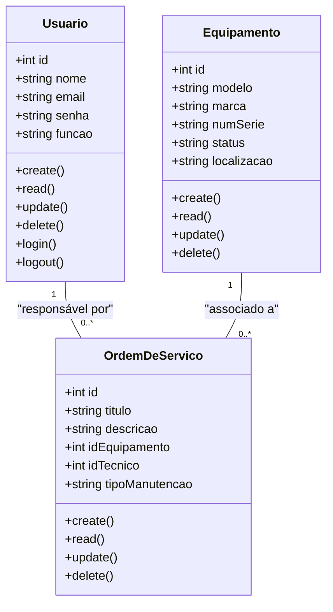
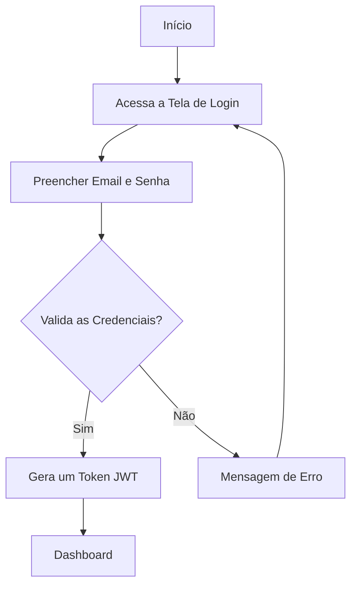

# 🧰 Sistema de Gestão de Manutenção (Formativa)

## 📘 Briefing

### 🔍 Visão Geral do Projeto

O projeto consiste no desenvolvimento de um **Sistema de Gestão de Manutenção (SGM)** no formato de uma aplicação web.

---

## 🧭 Escopo

### 🎯 Objetivos

*(Definir aqui os objetivos específicos do sistema, como otimizar processos de manutenção, registrar ocorrências, etc.)*

### 👥 Público-Alvo

* Técnicos de Manutenção
* Gestores de Manutenção
* Administradores do Sistema

### 💻 Recursos Tecnológicos

*(Listar tecnologias como Node.js, Express, Angular, MySQL, etc.)*

---

## 🧩 Diagramas (Mermaid, Miro, Draw.io)

### 1️⃣ Diagrama de Classes

Modela as principais entidades do sistema:

* **Usuários (User/Usuarios)**

  * Atributos: id, nome, email, senha, função
  * Métodos: create, read, update, delete, login, logout

* **Máquinas/Equipamentos (Equipment)**

  * Atributos: id, modelo, marca, numSerie, status, localizacao
  * Métodos: create, read, update, delete

* **Ordem de Serviço (Service)**

  * Atributos: id, titulo, descricao, idEquipamento, idTecnico, tipoManutencao
  * Métodos: create, read, update, delete

**📝 Explicação:**

* Um **Usuário (Técnico)** pode ser responsável por várias **Ordens de Serviço**.
* Um **Equipamento** pode estar associado a várias **Ordens de Serviço**.

---

### 2️⃣ Diagrama de Caso de Uso

Ilustra as interações dos diferentes tipos de usuários (atores) com as funcionalidades do sistema.

#### Atores:

* Técnico
* Gestor
* Administrador

#### Casos de Uso:

* Técnico: Gerenciar Ordens de Serviço (CRUD) e acessar o Dashboard
* Gestor: Gerenciar Ordens de Serviço (CRUD), Gerenciar Equipamento (CRUD), acessar o Dashboard
* Admin: Gerenciar Usuário e acessar o Dashboard

*(Antes de qualquer ação, o usuário deve fazer login)*

---

### 3️⃣ Diagrama de Fluxo (Login e Acesso ao Dashboard)

Descreve o passo a passo que um usuário segue para se autenticar no sistema e acessar o dashboard.

#### Explicação:

* O fluxo começa quando o usuário acessa a tela de login.
* Ele insere as credenciais (email e senha).
* O sistema verifica se as credenciais são válidas:

  * ✅ Se **sim** → Gera um **JWT Token** e redireciona para o **Dashboard**
  * ❌ Se **não** → Exibe mensagem de erro e o usuário permanece na tela de login

---

## ⚠️ Análise de Risco

### 📊 Matriz de Análise de Risco do Projeto SGM

A tabela abaixo apresenta os riscos identificados no projeto **SGM**, organizados por categoria, com probabilidade, impacto e estratégias de mitigação.

---

### 🔧 Riscos Técnicos

| ID | Risco                                    | Probabilidade | Impacto | Mitigação                                                                                                             |
| -- | ---------------------------------------- | ------------- | ------- | --------------------------------------------------------------------------------------------------------------------- |
| 1  | Chave secreta do JWT comprometida        | Média         | Alto    | Utilizar chaves secretas longas e complexas, armazená-las em variáveis de ambiente e implementar política de rotação. |
| 2  | Vulnerabilidade de truncamento do Bcrypt | Baixa         | Alto    | Garantir que a entrada para o hashing de senha nunca exceda 72 bytes e tratar a senha de forma isolada.               |
| 3  | Lentidão do sistema com aumento de dados | Média         | Média   | Otimizar consultas com indexação, implementar paginação e planejar escalabilidade.                                    |
| 4  | Código de baixa qualidade com bugs       | Alta          | Média   | Adotar práticas de código limpo, revisões de código e testes automatizados.                                           |

---

### 🗂️ Riscos de Gerenciamento

| ID | Risco                           | Probabilidade | Impacto | Mitigação                                                                         |
| -- | ------------------------------- | ------------- | ------- | --------------------------------------------------------------------------------- |
| 5  | Aumento do escopo (Scope Creep) | Alta          | Média   | Formalizar processo de controle de mudanças e avaliar impacto antes da aprovação. |
| 6  | Atraso na entrega do projeto    | Alta          | Média   | Utilizar metodologias ágeis e revisar cronograma a cada sprint.                   |
| 7  | Requisitos mal interpretados    | Média         | Alto    | Validar protótipos com usuários e manter comunicação constante.                   |

---

### 🏢 Riscos Organizacionais

| ID | Risco                                      | Probabilidade | Impacto | Mitigação                                                                          |
| -- | ------------------------------------------ | ------------- | ------- | ---------------------------------------------------------------------------------- |
| 8  | Resistência dos usuários à nova ferramenta | Média         | Alto    | Envolver usuários desde o início, criar interface amigável e comunicar benefícios. |
| 9  | Inserção de dados incorretos no sistema    | Média         | Alto    | Implementar validações robustas e, se possível, importar/validar dados existentes. |
| 10 | Falta de treinamento para os usuários      | Média         | Média   | Criar manuais de uso, realizar treinamentos práticos e oferecer suporte contínuo.  |

---

## 🧪 Prototipagem

🔗 [Acesse o protótipo no Figma](https://www.figma.com/design/QPBGLuRHFcyq18rsUQrwn0/Untitled?node-id=0-1&t=8IDLxRn4oddBpDxJ-1)

---

## 💻 Codificação
