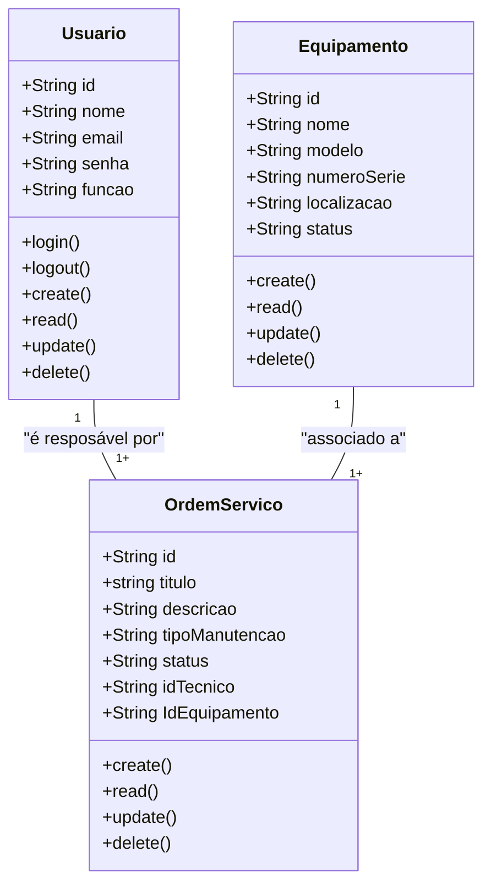
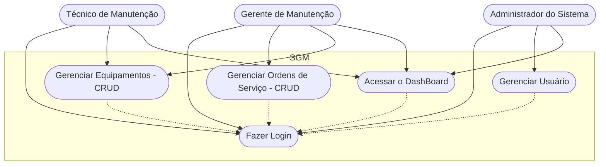
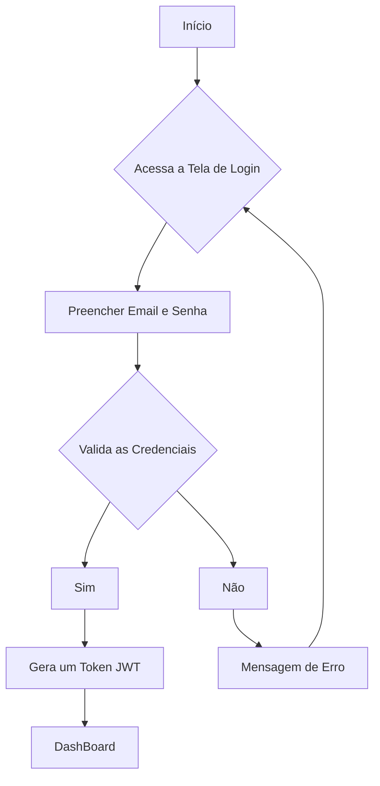

# Sistema de Gestão de Manutenção

## Briefing

### Visão Geral do progeto

- O projeto consiste no desenvolvimento de um Sistema de Gestão de Manutenção (SGM) no formato de uma aplicação web.

## Escopo

- ## Objetivos:

- ## Público-Alvo:
    - Técnicos de Manutenção
    - Gestores de Manutenção
    - Administradores do Sistema

- ### Recursos Tecnológicos:

## Diagramas (Mermaid, Miro, Draw.io)

1. ### Diagrama de Classe

- Este diagrama modela as principais entidades do sistema:
    - Usuários (Users/Usuarios) 
        - Campo:  Adm || User;
    - Máquinas/Equipamentos(Equipment);
    - Ordem de Serviço (Service);

#### Explicação do Diagrama de Classe
 - Um Usuário (Técnico) por ser responsável por várias Ordens de Servico
 - Um Equipamento por estar associado a várias Ordens de Serviço

 2. ### Diagrama de Caso de Uso
 Ilustrar as interações dos diferentes tipos de usuários (atores) com as funcionalidades do sistema

#### Explicação:
- Atores: Técnico, Gestor, Admin

- Casos de Usos:
    - Técnico: Gerenciar Ordens de Servico (CRUD) e acessar o DashBoard
    - Gestor: Gerenciar Ordens de Serviço (CRUD) , Gerenciar Equipamento (CRUD), Acessar o DashBoard
    -Admin: Gerenciar Usuário, acessar o DashBoard

    Fazer o Login -> Antes de Qualquer Ação

3. ### Diagram de Fluxo (Login e Acesso ao Dashboard)
Detalhar o passo a passo que um usuário segue para se autenticar no sistema a acessar o dashboard

#### Explicação:
- O Fluxo começa quando osuário acessa a tela de login
- Insere as credenciais( email e senha)
- O sistema verifica se as credenciais são válidas
    - se sim: gera um JWT (token) => dashboard
    - se não: mensagem de erro eusuário permanece na tela de l
    login

