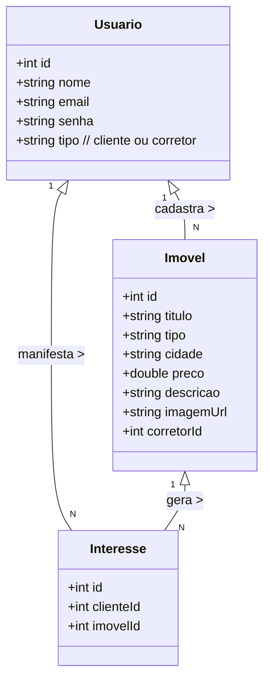
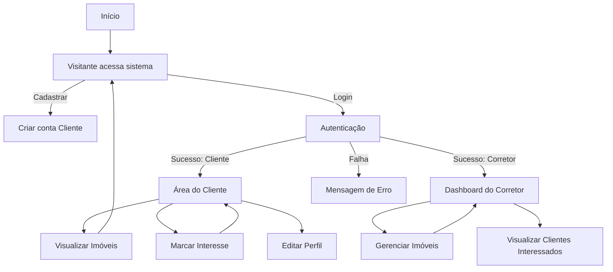

# 📘 Documentação do Projeto – Imobiliária Prime

## 📖 Introdução

O **Imobiliária Prime** é um projeto desenvolvido em **Angular**, com objetivo de simular uma plataforma de imobiliária online.
A aplicação permite que **clientes** possam visualizar imóveis, criar conta e registrar interesse em anúncios, enquanto **corretores** têm acesso a um painel administrativo para cadastrar, editar e gerenciar seus imóveis.

---

## 🎯 Objetivo

Construir uma **SPA (Single Page Application)** moderna, responsiva e segura, que facilite a interação entre clientes e corretores, utilizando autenticação, autorização e guarda de rotas para controle de acesso.

---

## 🛠️ Tecnologias

* **Angular** (framework principal)
* **TypeScript** (linguagem)
* **SCSS** (estilização)
* **JSON Server** (backend simulado)
* **LocalStorage / SessionStorage** (armazenamento de sessão)

---

## ⚙️ Funcionalidades

### Público (usuário não logado)

* Visualizar página inicial com imóveis em destaque.
* Acessar detalhes de um imóvel.
* Criar conta de cliente.

### Cliente (usuário logado como cliente)

* Login e autenticação.
* Marcar imóveis como “Tenho Interesse”.
* Listar imóveis de interesse.
* Editar informações de perfil.

### Corretor (usuário logado como corretor)

* Login (conta criada previamente pelo administrador).
* Painel administrativo com seus anúncios.
* CRUD completo de imóveis (criação, edição e exclusão).
* Visualizar clientes interessados em cada imóvel.

### Segurança

* **AuthGuard:** restringe o acesso a áreas privadas.
* **CorretorGuard:** garante que apenas corretores acessem o dashboard.

---

## 📋 Requisitos

### Requisitos Funcionais

1. O sistema deve permitir cadastro e login de clientes.
2. O sistema deve autenticar usuários e controlar a sessão.
3. O sistema deve permitir que clientes marquem interesse em imóveis.
4. O sistema deve exibir os imóveis cadastrados por corretores.
5. O sistema deve permitir CRUD de imóveis apenas para corretores.
6. O sistema deve exibir a lista de imóveis salvos pelo cliente.
7. O sistema deve permitir que corretores visualizem clientes interessados em seus imóveis.

### Requisitos Não Funcionais

1. A aplicação deve ser responsiva (adaptada para desktop e dispositivos móveis).
2. O frontend deve ser desenvolvido em Angular (versão mínima 15+).
3. O backend simulado deve ser implementado com JSON Server.
4. O tempo de resposta das interações deve ser inferior a 2 segundos.
5. O código deve seguir boas práticas de componentização e reutilização.
6. O sistema deve garantir que apenas usuários autenticados acessem áreas restritas.
7. A autenticação deve ser persistida no navegador (LocalStorage ou SessionStorage).

---

## 🗂️ Estrutura de Dados (db.json)

```json
{
  "usuarios": [
    { "id": 1, "nome": "Carlos Corretor", "email": "corretor@prime.com", "senha": "123", "tipo": "corretor" },
    { "id": 2, "nome": "Ana Cliente", "email": "cliente@email.com", "senha": "123", "tipo": "cliente" }
  ],
  "imoveis": [
    {
      "id": 1,
      "titulo": "Apartamento com vista para o mar",
      "corretorId": 1,
      "tipo": "Apartamento",
      "cidade": "Santos",
      "preco": 750000,
      "descricao": "Lindo apartamento com 3 quartos...",
      "imagemUrl": "url_da_imagem.jpg"
    }
  ],
  "interesses": [
    { "id": 1, "clienteId": 2, "imovelId": 1 }
  ]
}
```


## 📊 Diagramas

### Diagrama de Caso de Uso

```mermaid
usecaseDiagram
actor Cliente
actor Corretor
actor "Visitante" as Visitante

Cliente --> (Fazer Login)
Cliente --> (Cadastrar Conta)
Cliente --> (Visualizar Imóveis)
Cliente --> (Marcar Interesse em Imóvel)
Cliente --> (Editar Perfil)
Cliente --> (Visualizar Imóveis Salvos)

Corretor --> (Fazer Login)
Corretor --> (Gerenciar Imóveis)
Corretor --> (Visualizar Clientes Interessados)

Visitante --> (Visualizar Página Inicial)
Visitante --> (Visualizar Detalhes de Imóvel)
```

---

### Diagrama de Classes



---

### Diagrama de Fluxo do Sistema (Login e Acesso)



## 📌 Conclusão

  O projeto **Imobiliária Prime** aplica conceitos fundamentais de desenvolvimento web com Angular, incluindo **componentização, serviços, guardas de rota e integração com backend simulado**.
Com diferenciação de perfis (cliente e corretor) e regras de acesso, a aplicação entrega uma experiência próxima de um sistema real de imobiliária.
