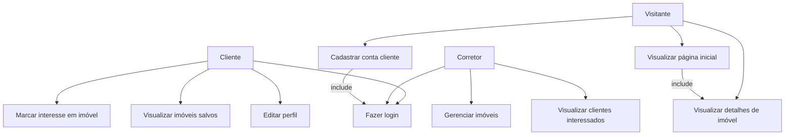
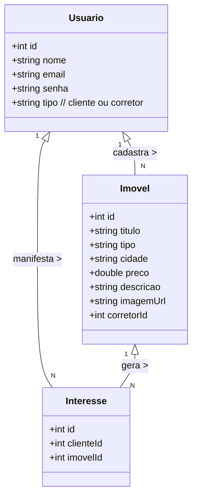
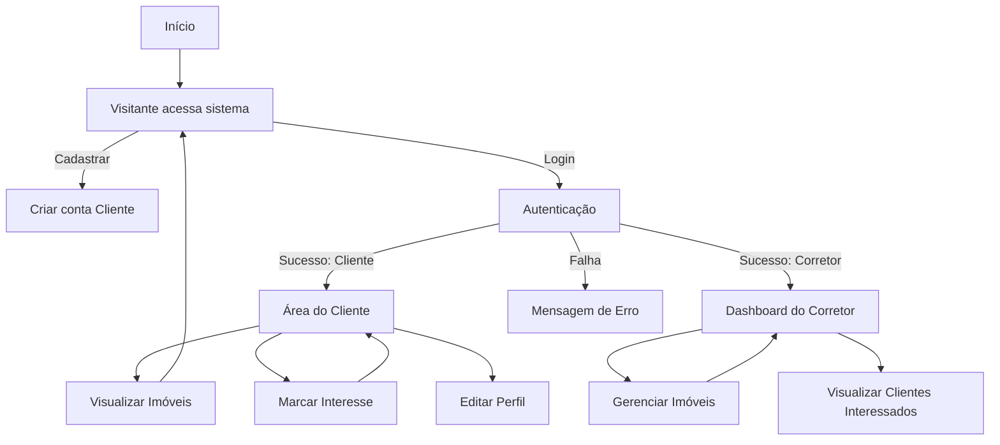

# 📘 Documentação do Projeto – Imobiliária Prime

## 📖 Introdução

O **Imobiliária Prime** é uma aplicação web desenvolvida em **Angular** que simula uma plataforma de imobiliária online.  
A ideia é permitir que **clientes** naveguem pelos imóveis disponíveis, criem uma conta e expressem interesse em anúncios, enquanto **corretores** gerenciam seus próprios imóveis por meio de um painel administrativo.

O projeto foi construído com foco em boas práticas de desenvolvimento frontend: autenticação, autorização, guarda de rotas, componentização e integração com um backend simulado.

## 🎯 Objetivo

Desenvolver uma **SPA (Single Page Application)** moderna, responsiva e segura, que permita a interação entre dois perfis de usuário — **cliente** e **corretor** — com controle de acesso baseado em funções.

## 🛠️ Tecnologias Utilizadas

- **Frontend**: Angular (v15+), TypeScript, SCSS  
- **Backend simulado**: JSON Server  
- **Persistência de sessão**: `localStorage`  
- **Ferramentas**: Angular CLI, npm

## ⚙️ Funcionalidades

### Público (não logado)
- Visualizar a página inicial com imóveis em destaque  
- Acessar a página de detalhes de qualquer imóvel  
- Criar uma conta do tipo **cliente**

### Cliente (logado)
- Fazer login com e-mail e senha  
- Marcar imóveis como “Tenho Interesse”  
- Visualizar a lista de imóveis salvos  
- Editar seu próprio perfil (nome e senha)

### Corretor (logado)
- Fazer login com credenciais pré-cadastradas  
- Acessar o **dashboard** com seus imóveis  
- Realizar **CRUD completo** de imóveis (criar, ler, atualizar, excluir)  
- Visualizar quais **clientes demonstraram interesse** em cada imóvel

### Segurança
- **`AuthGuard`**: impede acesso a rotas privadas sem autenticação  
- **`CorretorGuard`**: permite acesso ao dashboard apenas para usuários do tipo *corretor*

## 📋 Requisitos

### Requisitos Funcionais
1. O sistema deve permitir cadastro e login de clientes.  
2. O sistema deve autenticar usuários e manter a sessão ativa.  
3. Clientes devem poder marcar interesse em imóveis.  
4. Todos os usuários devem visualizar os imóveis cadastrados.  
5. Apenas corretores podem criar, editar ou excluir imóveis.  
6. Clientes devem visualizar a lista de imóveis que marcaram como interesse.  
7. Corretores devem ver quais clientes se interessaram por cada imóvel.

### Requisitos Não Funcionais
1. A interface deve ser **responsiva** (funcionar bem em mobile e desktop).  
2. O frontend deve usar **Angular 15 ou superior**.  
3. O backend deve ser simulado com **JSON Server**.  
4. O tempo de resposta das operações deve ser **inferior a 2 segundos** (em ambiente local).  
5. O código deve seguir boas práticas: componentes reutilizáveis, serviços bem definidos e injeção de dependência.  
6. Apenas usuários autenticados devem acessar rotas protegidas.  
7. A sessão do usuário deve ser persistida com `localStorage`.

## 🗂️ Estrutura de Dados (`db.json`)

```json
{
  "usuarios": [
    {
      "id": 1,
      "nome": "Carlos Corretor",
      "email": "corretor@prime.com",
      "senha": "123",
      "tipo": "corretor"
    },
    {
      "id": 2,
      "nome": "Ana Cliente",
      "email": "cliente@email.com",
      "senha": "123",
      "tipo": "cliente"
    }
  ],
  "imoveis": [
    {
      "id": 1,
      "titulo": "Apartamento com vista para o mar",
      "corretorId": 1,
      "tipo": "Apartamento",
      "cidade": "Santos",
      "preco": 750000,
      "descricao": "Lindo apartamento com 3 quartos, sacada gourmet e vista para o mar.",
      "imagemUrl": "assets/imoveis/apto-mar.jpg"
    }
  ],
  "interesses": [
    {
      "id": 1,
      "clienteId": 2,
      "imovelId": 1
    }
  ]
}
````

## 📊 Diagramas

### 🔹 Diagrama de Caso de Uso


```mermaid
flowchart TD
    %% Atores
    Visitante["Visitante"]
    Cliente["Cliente"]
    Corretor["Corretor"]

    %% Casos de uso
    CU1["Visualizar página inicial"]
    CU2["Visualizar detalhes de imóvel"]
    CU3["Cadastrar conta cliente"]
    CU4["Fazer login"]
    CU5["Marcar interesse em imóvel"]
    CU6["Visualizar imóveis salvos"]
    CU7["Editar perfil"]
    CU8["Gerenciar imóveis"]
    CU9["Visualizar clientes interessados"]

    %% Relacionamentos: ator -> caso de uso
    Visitante --> CU1
    Visitante --> CU2
    Visitante --> CU3

    Cliente --> CU4
    Cliente --> CU5
    Cliente --> CU6
    Cliente --> CU7

    Corretor --> CU4
    Corretor --> CU8
    Corretor --> CU9

    %% Relacionamentos de include (uso de setas tracejadas não é suportado no GitHub,
    %% então usamos setas normais com rótulo)
    CU1 -->|include| CU2
    CU3 -->|include| CU4


    class Visitante,Cliente,Corretor actor
    class CU1,CU2,CU3,CU4,CU5,CU6,CU7,CU8,CU9 usecase
```

### 🔹 Diagrama de Classes


```mermaid
classDiagram
    class Usuario {
      +int id
      +string nome
      +string email
      +string senha
      +string tipo  // cliente ou corretor
    }

    class Imovel {
      +int id
      +string titulo
      +string tipo
      +string cidade
      +double preco
      +string descricao
      +string imagemUrl
      +int corretorId
    }

    class Interesse {
      +int id
      +int clienteId
      +int imovelId
    }

    Usuario "1" <|-- "N" Imovel : cadastra >
    Usuario "1" <|-- "N" Interesse : manifesta >
    Imovel "1" <|-- "N" Interesse : gera >
```

### 🔹 Fluxo do Sistema (Login e Acesso)


```mermaid
flowchart TD
    A[Início] --> B[Visitante acessa sistema]
    B -->|Cadastrar| C[Criar conta Cliente]
    B -->|Login| D[Autenticação]

    D -->|Sucesso: Cliente| E[Área do Cliente]
    D -->|Sucesso: Corretor| F[Dashboard do Corretor]
    D -->|Falha| G[Mensagem de Erro]

    E --> H[Visualizar Imóveis]
    E --> I[Marcar Interesse]
    E --> J[Editar Perfil]

    F --> K[Gerenciar Imóveis]
    F --> L[Visualizar Clientes Interessados]

    H --> B
    K --> F
    I --> E
```

## 📌 Conclusão

O **Imobiliária Prime** demonstra, de forma prática e didática, como construir uma aplicação Angular com múltiplos perfis de usuário, controle de acesso e integração com API.
Apesar de usar um backend simulado e autenticação simplificada, o projeto segue boas práticas de arquitetura, segurança e usabilidade — servindo como base sólida para sistemas reais.
