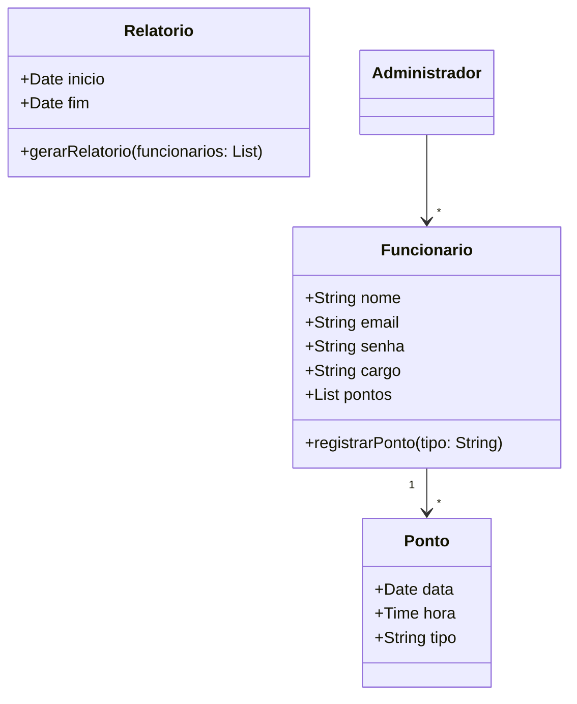
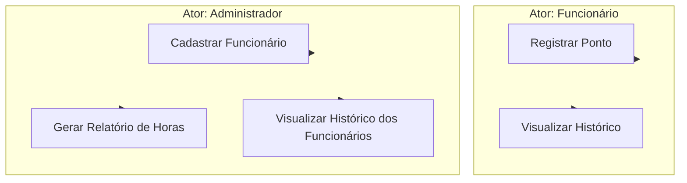
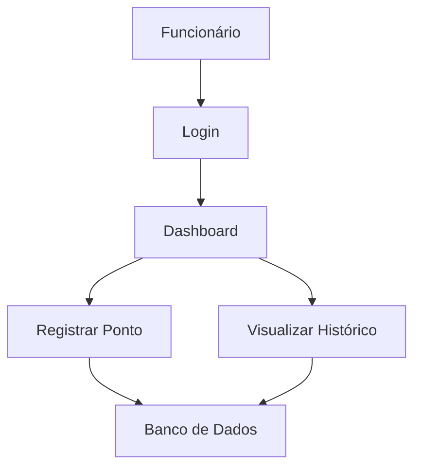

# Sistema de Controle de Ponto Simplificado – ContaCerta

## 1. Interpretação do Briefing e Escopo do MVP

O sistema tem como objetivo substituir a folha de ponto manual por uma solução digital que permita:

* Funcionários registrarem entrada e saída automaticamente.
* RH gerenciar funcionários e gerar relatórios de horas.

**Escopo do MVP:**

* CRUD de funcionários.
* Registro de ponto com alternância automática entre Entrada/Saída.
* Visualização de histórico diário/mensal do funcionário.
* (Bônus) Cálculo automático de horas trabalhadas.

---

## 2. Modelagem de Dados (Diagrama de Classes/Entidades)



---

## 3. Modelagem de Processos (Casos de Uso e Fluxo)

### 3.1 Diagrama de Casos de Uso



### 3.2 Diagrama de Fluxo



---

## 4. Análise de Papéis (Roles) e Permissões

| Papel         | Permissões                                                         |
| ------------- | ------------------------------------------------------------------ |
| Funcionário   | Registrar ponto, visualizar histórico próprio                      |
| Administrador | CRUD funcionários, gerar relatórios, visualizar histórico de todos |

---

## 5. Backend – Modelos Mongoose (MongoDB)

* **Funcionario.ts**

```ts
const mongoose = require('mongoose');
const FuncionarioSchema = new mongoose.Schema({
    nome: String,
    email: String,
    senha: String,
    cargo: String,
    pontos: [{ type: mongoose.Schema.Types.ObjectId, ref: 'Ponto' }]
});
module.exports = mongoose.model('Funcionario', FuncionarioSchema);
```

* **Ponto.ts**

```ts
const mongoose = require('mongoose');
const PontoSchema = new mongoose.Schema({
    data: Date,
    hora: String,
    tipo: { type: String, enum: ['Entrada','Saída'] },
    funcionario: { type: mongoose.Schema.Types.ObjectId, ref: 'Funcionario' }
});
module.exports = mongoose.model('Ponto', PontoSchema);
```

---

## 6. Implementação de APIs RESTful Seguras (Next.ts API Routes)

* **Exemplos de endpoints:**

```
GET /api/funcionarios         -> Listar funcionários (Admin)
POST /api/funcionarios        -> Criar funcionário (Admin)
PUT /api/funcionarios/:id     -> Atualizar funcionário (Admin)
DELETE /api/funcionarios/:id  -> Deletar funcionário (Admin)

POST /api/pontos              -> Registrar ponto (Funcionário)
GET /api/pontos/:funcionario  -> Listar pontos (Funcionário/Admin)
```

* Autenticação via **JWT**, middleware verifica token e role.

---

## 7. Autenticação e Autorização (JWT/Roles)

* Login gera **JWT** com informações do usuário e role.
* Middleware valida o token e garante acesso aos endpoints conforme a role.
* Senhas criptografadas com **Bcrypt**.

---

## 8. Frontend e Lógica de Componentes (Next.ts)

* Dashboard com cards de ponto e histórico.
* Formulário de registro de ponto que alterna automaticamente entre Entrada/Saída.
* Tabela de histórico de pontos por dia/mês.
* Componentes SCSS modularizados.

---

## 9. Lógica de Negócio Essencial (Core do MVP)

* Alternância automática entre tipo de ponto.
* Cálculo do total de horas trabalhadas por dia (Bônus).
* Validação de horários e não duplicidade de registro no mesmo período.

---

## 10. Organização e Uso de SCSS

* Arquivos separados por componente:

```
/styles
  global.scss
```

* Uso de variáveis, mixins e nesting para manter consistência.

---

## 11. Consistência e Qualidade da Interface (UX/UI)

* Interface limpa, intuitiva e responsiva.
* Dashboard simples com cards informativos.
* Feedback visual para registro de ponto realizado com sucesso.

---

## 12. Tratamento de Erros e Validações

* Validação de campos obrigatórios no frontend e backend.
* Mensagens de erro claras para o usuário.
* Logs de erro no backend para análise futura.

---

## 13. Demonstração das Funcionalidades e Requisitos Essenciais

* Funcionário: login, registrar ponto, visualizar histórico.
* Administrador: login, CRUD funcionários, gerar relatórios.

---

## 14. Implementação do Diferencial (Bônus)

* Cálculo automático do total de horas trabalhadas por dia.
* Dashboard com total de horas diárias para cada funcionário.

---

## 15. Protótipo de Interface

* Link Figma: **[https://www.figma.com/design/46LjBCrboa8qodaZNqozUE/Untitled?node-id=0-1&t=nxhuSaG5RHacOHpb-1]**

---

## 16. Estrutura de Pastas (Next.ts)

```
src/
├── app/
│   ├── api/
│   │   ├── auth/
│   │   │   └── route.ts
│   │   ├── funcionarios/
│   │   │   └── route.ts
│   │   └── pontos/
│   │       └── route.ts
│   ├── dashboard/
│   │   └── page.tsx
│   ├── login/
│   │   └── page.tsx
│   ├── favicon.ico
│   ├── globals.css
│   ├── layout.tsx
│   ├── page.module.css
│   └── page.tsx
├── lib/
│   ├── dbConnect.ts
│   ├── mongodb.ts
│   └── models/
│       ├── Funcionario.ts
│       └── Ponto.ts
├── middleware/
│   ├── auth.ts
│   └── role.ts
└── styles/
    └── globals.scss

```
